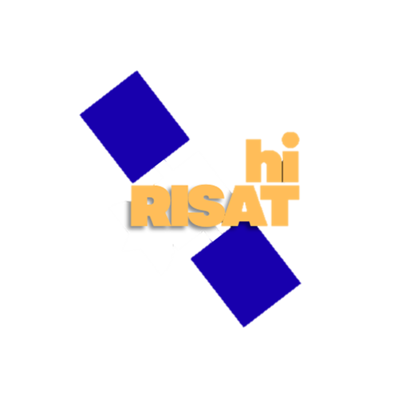

# hiRISAT - ISRO RISAT Pass Predictor

A modern, web-based satellite tracking application focused on ISRO’s **Radar Imaging Satellite (RISAT)** constellation. 

## Features
- **Real-time Pass Prediction**  
  Accurate rise, peak, and set timings for RISAT satellites using SGP4 propagation.
- **Automated TLE Updates**  
  Orbital data is fetched from CelesTrak every 24 hours to maintain prediction accuracy.
- **Modern Glass UI**  
  A clean “Space Black” interface with subtle animations and gold accents.
- **IST & UTC Support**  
  Built-in clocks, time conversion, and countdown timers for upcoming passes.
- **Fleet Intelligence**  
  Mission background and status information for each tracked RISAT satellite.

## Supported Satellites
- RISAT-1
- RISAT-2B
- RISAT-2BR1
- RISAT-2BR2

> Some RISAT satellites are not publicly trackable due to orbital decay or restricted
> availability of TLE data.

## Tech Stack
- **Frontend**: React, Vite, Framer Motion, React Icons
- **Backend**: FastAPI, Python (SGP4, APScheduler)

## About the Project
I love everything about ISRO and satellites now.
