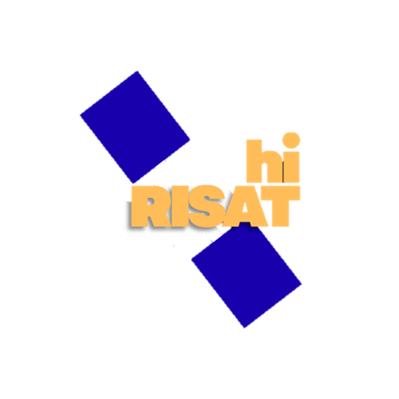

# hiRISAT


**The Advanced Mission Control Dashboard for ISRO's RISAT Constellation.**

hiRISAT is a high-precision satellite tracking and ground station scheduling engine built for ISRO’s RISAT constellation. It combines orbital propagation (SGP4), link feasibility estimation, and intelligent conflict resolution into a unified “Mission Control” dashboard.

---

## 🚀 Modules

### 1. Pass Predictor (Home)
A real-time dashboard for tracking individual satellites.
- **Next Pass Countdown**: Prominent timer for the upcoming contact.
- **Live Orbit Data**: Calculates Elevation, Azimuth, and Range using SGP4 propagation.
- **Card-Based Grid**: View all upcoming passes in a clean, scrollable grid with expanding details (Mean Elevation, Orbit Direction).
- **Multi-Station Support**: Switch between multiple Ground Stations instantly.
- **Pass Feasibility Engine**: Elevation filtering, usable duration estimation, and link margin calculation.
- **Link Budget Estimation**: Free Space Path Loss (FSPL), atmospheric losses, received power, and data opportunity estimation.

### 2. Scheduling Dashboard
A comprehensive tool for managing ground station resources.
- **Conflict Detection**: Automatically identifies and flags overlapping passes across multiple satellites.
- **Optimization**: "Drops" conflicting passes based on priority (Max Elevation + Duration score) to ensure the best possible schedule.
- **Station Metrics**: Real-time stats on Utilization %, Active Hours, and Conflict Rates.
- **Visual Status**: Neon indicators for "Scheduled" (Cyan) vs "Dropped" (Red) passes.

### 3. Mission Status (About)
A dedicated space for project philosophy and developer insights.
- **Tech Stack Visualization**: Badges for the core technologies used.
- **Developer Profile**: Connect with the creator.


## ⚡ Getting Started

### Tech Stack
- **Backend**: FastAPI, Uvicorn, SGP4
- **Scheduler**: Automated TLE updates (24-hour sync)
- **Frontend**: React, TailwindCSS, Chart.js, Framer Motion
- **Deployment**: Vercel, Railway

### Installation

1. **Clone the repository**
   ```bash
   git clone https://github.com/BrownCurryyy/hiRISAT.git
   cd hiRISAT
   ```

2. **Backend Setup**
   ```bash
   cd backend
   pip install -r requirements.txt
   python -m uvicorn app:app --reload
   ```

3. **Frontend Setup**
   ```bash
   cd frontend
   npm install
   npm run dev
   ```

---

## 📡 Supported Satellites
- **RISAT-1** (Radar Imaging Satellite 1)
- **RISAT-2B** (X-Band SAR)
- **RISAT-2BR1**
- **RISAT-2BR2**

---

Built as an independent systems engineering project to simulate real-world satellite ground operations.